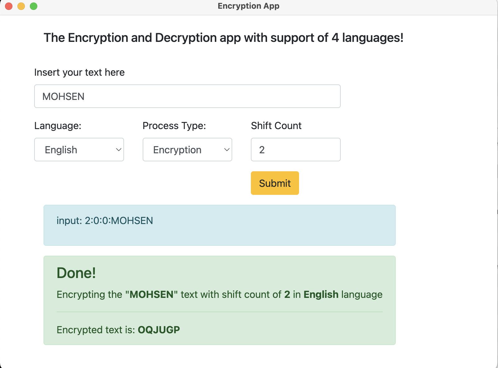
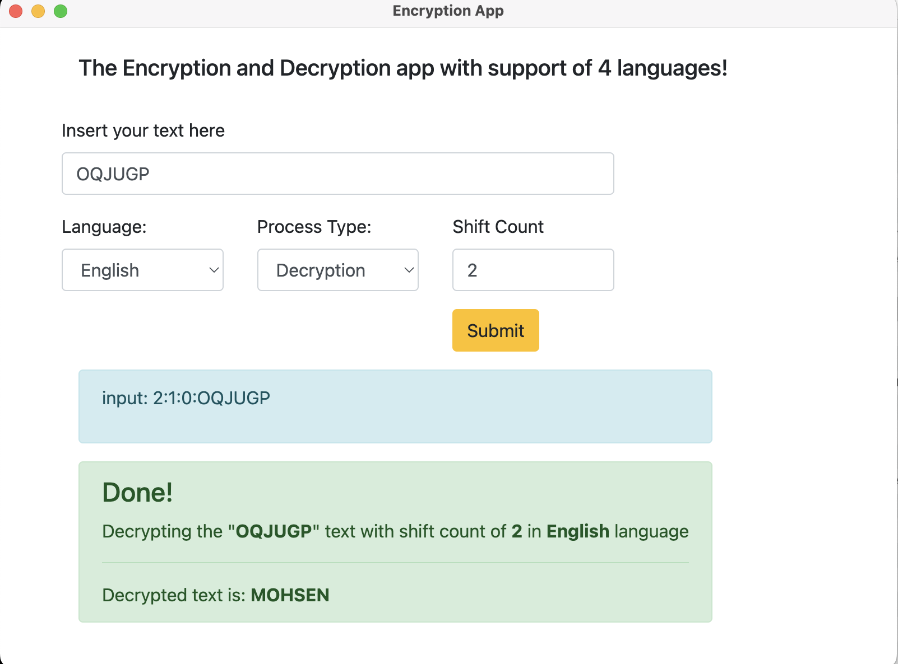

# Encryption & Decryption of Text Using Caesar Cipher

Caesar Cipher is one of the simplest and most widely known encryption techniques. As we mention in class this method is a kind of substitution cipher in which each letter in the plain-text is replaced by a letter some fixed number of positions down the alphabet. Developed application should have following features;

1.  Number of shift countNo can be variable and application should take this parameter from file (Details given in following parts). And according to this number new dictionary created.

2.  Application should support encryption and decryption methods. These methods should be taken from file again (Details given in following parts). In encryption the text which is given as plain-text form (from file) should be converted to cipher-text according to dictionary created in first step. And this cipher-text should printed to screen. In decryption, encrypted text should be taken by application (From file) . Then according to dictionary in reverse order it should be converted back to plain-text.

## This Desktop Application Created By Electron Using Javascript

### can be used in 3 main desktop platforms:

- MacOS
- Linux
- Windows

### Files compatible for platfrom are available in zip files under [executable](https://github.com/mohsenkhashei/encryptionDecryption-Caesar-Cipher/tree/main/executable) folder

> Just Download the Compatible file of your operating system and open that then:

- insert your text
- select your prefered language
- select process type Encryptin or Decryption
- set prefer shift count

 
 =========================================================================

 

### Demo

#### Encryption

#### Decryption

 

## For Developing Usage:

in the root of Application:
`npm install`
 
for run the app locally:
`npm run start`
 
for generate new executable file:
`electron-builder -mwl`
